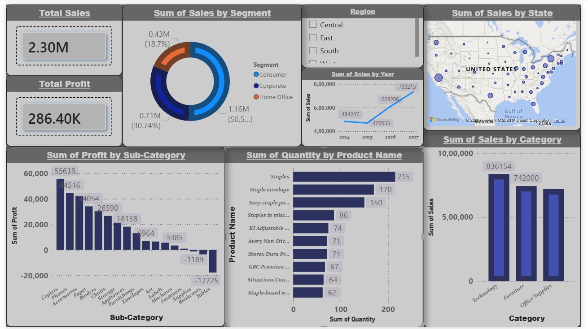

# Superstore Sales Data Analytics - End-To-End Pipeline

## Project Overview This Project demonstrate an end-to-end data analytics pipeline using a Superstore sales dataset. The goal of this project was to analyze historical sales data, perform data cleaning and exploratory data anlysis (EDA) and build an interactive business dashboard to uncover key insights regarding revenue, profit margins, and loss-making categories.

## Tools and Technologies Used

* **python (jupyter Notebook):**
Data cleaning, Data Preprocessing, and Exploratory Data Analysis (EDA) using 'pandas','matplotlib', and 'seaborn'. 
* **Power BI:** 
Data Visualization, Dashboard Design, and Interactive Reporting.

## Work Flow
1. ** Data Cleaning (Python):**
Imported the raw dataset, handled null values, removed inconsistencies/extra spaces, and exported a clean CSV file ready for visualization.
2. ** Data Visualization (Power BI):**
Connected the clean dataset to Power BI and designed an interactive modern card-style dashboard featuring:
    * KPI Cards for high-level metrics (Total Revenue, Total Profit).
    * Geospatial mapping for State-wise sales distribution.
    * Bar charts filtering the Top 10 Best-Selling Products.
    * Visual Identification of loss-making sub-categories (Tables & Bookcases).

## Key Business Insights 
* Discovered that while overall sales were strong, specific sub-categories like 
**Table and Bookcases** were operating at a loss.
*Visualized the geographical hotspots for sales across the US, allowing for better regional targeted marketing.
*Created an interactive slicer allowing stakeholders to drill down data by specific Refions (Central, East, South, West) in real-time.

## Dashboard Preview
